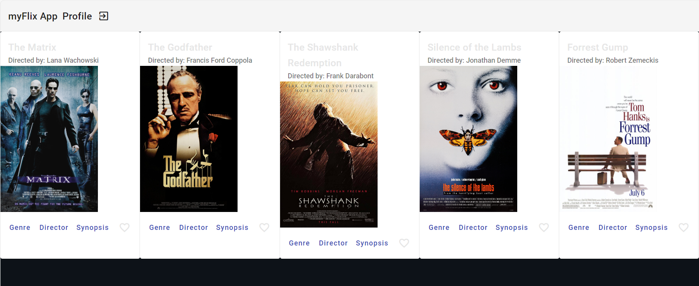

# MyFlixAngularClient

MyFlix is a web application that allows users to discover and manage their favorite movies. It provides a user-friendly interface for browsing movie details, genres, and directors. Users can create accounts, log in, and personalize their movie preferences.

This project was generated with [Angular CLI](https://github.com/angular/angular-cli) version 16.2.1.

## Development server

Run `ng serve` for a dev server. Navigate to `http://localhost:4200/`. The application will automatically reload if you change any of the source files.

## Code scaffolding

Run `ng generate component component-name` to generate a new component. You can also use `ng generate directive|pipe|service|class|guard|interface|enum|module`.

## Build

Run `ng build` to build the project. The build artifacts will be stored in the `dist/` directory.

## Running unit tests

Run `ng test` to execute the unit tests via [Karma](https://karma-runner.github.io).

## Technologies Used

Angular: Frontend web framework for building the user interface and interactions.

TypeScript: Superset of JavaScript used for developing Angular applications.

Angular Material: UI component library providing pre-built, customizable UI elements.

Node.js: Backend JavaScript runtime for running the development server.

MongoDB: NoSQL database for storing movie and user data.

Express.js: Backend framework for creating RESTful APIs and server-side functionalities.

Heroku: Cloud platform used for deployment.

## Further help

To get more help on the Angular CLI use `ng help` or go check out the [Angular CLI Overview and Command Reference](https://angular.io/cli) page.
